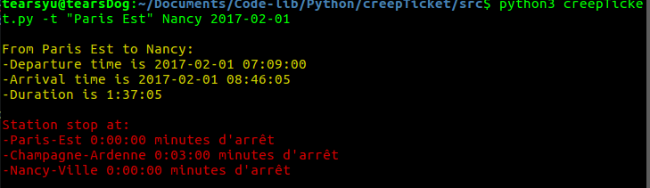
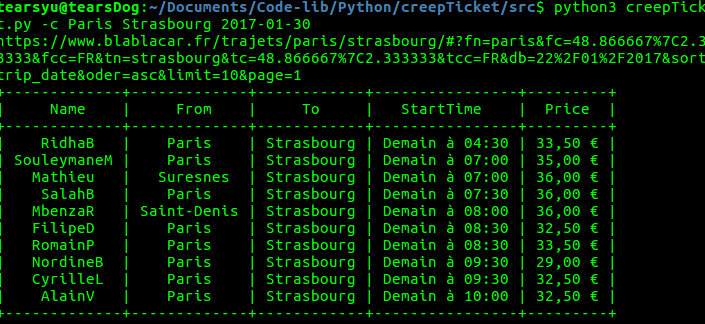

# <center> RAPPORT DU PROJET PERSONNEL </center>
##### <center>Web Spider du covoiturage et du ticket du train</center>
<br/>
<br/>
<br/>
<br/>
<br/>
<br/>
<center>
Tutrice: __Nathalie Champroux__ <br>
Auteur: __Yuxin SHI__<br>
__ING 1 FISE__   
</center>
<br/>


<center>
<br>
<br>
<br>
Université Paris-Est Créteil Val de Marne <br>
Ecole supérieure d'ingénieurs de Paris-Est
</center>
<br>
<br>
<br>

<h1><center>Contents</center></h1>

* [I. INTRODUCTION](#1)

* [II. REALISATION](#2)

* [III. USAGE](#3)

* [IV. Conclusion](#4)


<h1 id="1"> <center>I. INTRODUCTION </center> </h1>
---
<p>
Le projet personnel "Web Spider du covoiturage et du ticket du train" sert à lancer une cherche de ticket de SNCF ou une cherche de covoiturage chez blablacar par la ligne commande et afficher les résultats dans le console.   
Ce qui m'a motivé de faire ce petit outil, c'est que mon ordinateur portable est trop lent pour démarrer le navigateur et trop embétant de choisir la destination la date dans le web. Chaque fois Daniel(mon petit copin) et moi nous voulons rentrer  chez ses parents qui habitent pas loin de Paris par le train, personne lit l'emploi du temps et on passe souvant le train et on est obligé d'attendre le prochain train à la station pendant des heures en dépençant des sous pour deux caffé dégeulasse.  
Le but de ce projet est d'afficher l'emploi du temps du transport très efficace sans lancer le navigateur, et on economise le temps.  
J'ai utilisé Python3 pour réaliser ce projet, ainsi le module de `requests`, `json`, `prettytable`, `BeautifulSoup`, etc fournissent par python3.
</p>

<h1 id = "2"> <center>II. REALISATION</center> </h1>
Ce projet propose deux sources de cherche, soit SNCF, soit covoiturage chez Blablacar.  
Pour obtenir l'information, j'ai utilisé deux façon différente pour ramasser et sélectionner les données.  
## a. SNCF
SNCF a très bien fait le travail d'anti web spider, je ne peux pas rassembler les données directement par le moyen classique (Télécharger le fichier HTML et analyser ce fichier.) Mais ils ont développé un bon API pour les développeur qui s'intérêsé par l'information de train SNCF. Il faut juste s'inscrire sur le site de SNCF data et il nous fournit un code pour connecter leur serveur de base de données.  
On lance une requête au serveur de base de données avec l'authentification du code, il nous renvoye le résultat en format "json".  

### Une exemple
Si on veut savoir l'emploi du temps les prochains départs à Montparnasse, la requête est:
https://api.sncf.com/v1/coverage/sncf/stop_areas/stop_area:OCE:SA:87391003/departures?datetime=20161125T140917  
où `87391003` est le code de la station Montparnasse, on peut retrouver tous les code des station de france sur un autre fichier sur ce site, et `departures?` est le mot clé de cette requête avec la date 2016-11-25 14:09:17.  Et on obtient le résultat sur web:  
  
Mais c'est difficile à lire ces données, il y a beaucoup d'information inutile, on peut écrire un petit programme pour filtrer ces données.

### Blocks du code
Ceci j'ai mit une partie du code, qui sert à lancer une demande du prochain train d'une ville à une autre ville avec une date précise.
``` python
url = 'https://api.sncf.com/v1/coverage/sncf/journeys?'\
    'from=stop_area:OCE:SA:{}&to=stop_area:OCE:SA:{}&datetime={}'\
    .format(from_statiom, to_station, date)

    #Begin with error handle
    try:
        r = requests.get(url, auth=(token_auth, ''))
    except Exception:
        print("Sorry, an unexpected error occurred when I connect to api SNCF, please check your networking.")
        quit()
```

## b. Covoiturage
<p>
Blablacar fait peu pour anti web spider, donc j'utilise directement le moyen classique pour rassembler les données depuis le fichier HTML grace au module `BeautifulSoup`.     
Poson qu'on observe la requête de web est:
https://www.blablacar.fr/trajets/paris/colmar/#?fn=Paris&fc=48.856614%7C2.352222&fcc=FR&tn=Colmar&tc=48.079359%7C7.358512&tcc=FR&db=29%2F01%2F2017&sort=trip_date&order=asc&limit=10&page=1  
où `fn` est la ville du départ ou arrivée, `fc` est ses latitude et aptitude, `db` indique la date du départ, `page` indique le numéro de la page du web. Ça signifie une demande de covoiturage à la date 2017-01-29 de Paris à Colmar.  
Ce que j'ai fait est d'analyse la structure du web, sélectionne les classes et les indexs utiles en affichant dans une table.
</p>

### Blocks du code
Ceci une partie du code pour traiter les données réçues et en mettre dans les listes.
``` python
    try:
        bbcar = requests.get(url)
        soup = bs4.BeautifulSoup(bbcar.text, "lxml")
    except requests.exceptions.RequestException as e:
        print("Error {}".format(e))
        quit()
    else:
        exrp = re.compile('<[^>]+>')
        #list of name
        list_name = []
        for line in soup.body.find_all("h2", class_="ProfileCard-info ProfileCard-info--name u-truncate"):
            list_name.append(exrp.sub("",str(line).replace(' ','').replace('\n','')))

        #list of city from and to
        list_city_all = []
        list_city_from = []
        list_city_to = []
        for line in soup.body.find_all("span", "trip-roads-stop"):
            list_city_all.append(exrp.sub("", str(line).replace(' ', '')))
        i = 0
        for line in list_city_all:
            if i%2 is 0:
                list_city_from.append(line)
            else:
                list_city_to.append(line)
            i += 1

        #list of start time
        list_start_time = []
        for line in soup.body.find_all("h3","time light-gray"):
            tostring = exrp.sub("",str(line).replace('\n',''))
            list_start_time.append(tostring)

        #list of links
        list_links = []
        for line in soup.body.find_all("a", "trip-search-oneresult"):
            tmp = 'https://www.blablacar.fr{}'.format(line['href'])
            list_links.append(tmp)

        #list of Price
        list_price = []
        for line in soup.body.find_all("div", class_ = "price price-black"):
            list_price.append(exrp.sub("",str(line).replace(' ','').replace('\n','').replace('parplace',''))
```
<br>
<br>
<br>
<br>
<br>
<br>

<h1 id = "3"> <center> III. USAGE </center></h1>
---
Grace au module `opt`, on peut créer facilement une règle pour parser une ligne de commande.   

``` python
"""Tickets creepy
Usage:
    creepTicket [-cth] <from> <to> <date>

Options:
    -h,--help                       show help list
    -c,--covoiturage                covoiturage
    -t,--train                      train SNCF

Example:
    python3 creepTicket.py -t Nantes Lille 2016-10-01-20-30-00
    python3 creepTicket.py -t Colmar Nancy 2017-01-20
    python3 creepTicket.py -t 'Paris Est' Colmar 2016-12-20
    python3 creepTicket.py -c Nancy Strasbourg 2017-01-25
"""
```
<br>

Par exemple, on cherche le train le pls tôt de Paris est à Nancy le Nancy 2017-02-01, la ligne de commande est   
`$ python3 creepTicket.py -t "Paris Est" Nancy 2017-02-01`   
  

Vous pouvez aussi préciser le temps comme 2016-10-01-20-30-00 si vous voulez, sinon il affiche toujours le train le plus tôt correspondant.       

Si on veut chercher les covoiturages:   
`python3 creepTicket.py -c Paris Strasbourg 2017-01-30`  

<br/>
<br/>
<br/>
<br/>
<br>
<br>
<br>
<br>
<br>
<br>
<br>
<br>
<br>
<br>
<br>

<h1 id = "4"> <center> IV. Conclusion </center> </h1>
---
<p>
J'en ai pas quelque chose spéciale à conclure. Je me suis bien amuse dans ce projet.   
Mais il y a un soucis dans ce soucis, pour la cherche de covoiturage, on ne peut que indexer l'emploi du temps de la date plus proche de maintenant, parce que la page de blablacar affiche toujours d'abord les données de la date plus proche, puis la page refraîche automatiquement, et la deuxième fois on a des données correspondant à la date donnée. Donc mon programme recupère toujours les données de première fois. Je ne sais pas si c'est un bug de leur site ou c'est un méganisme d'anti web spider. Je n'ai toujours pas de solution pour régler ce problème. Et je trouve que la table imprimée n'est pas jolie ni visible, peut-être j'aurais du reécrire la classe `prettytable` pour qu'il s'affiche comme je veux, avec la couleur.
<br/>
Les codes sources:<br>
https://github.com/yuxinvalo/SpiderTransf
</p>
